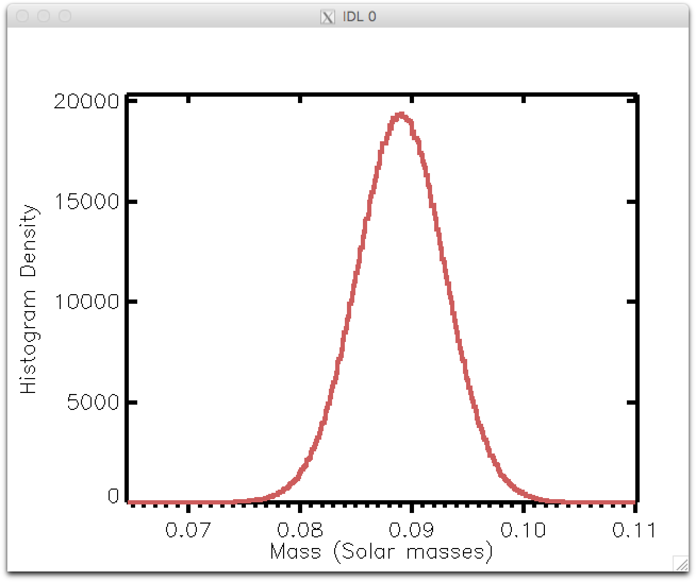

# M_-M_K-

This code is meant to provide realistic masses and uncertainties of (single) low-mass stars given a user-provided 2MASS Ks and distance (and uncertainties). 

The code will read in the included posterior from Mann et al. (soon, be patient) to estimate the error arising from scatter in the relation itself. The output is a posterior on stellar mass (Solar units). You can also request 1D (mean and sigma) errors if those are preferred.

You can include [Fe/H] if it is known. In this scenario the code will use a Mk-Mass-[Fe/H] relation. Note that the [Fe/H] term is technically not statistically significant. So this is mostly for illustrative purposes or tests on stars with extreme metallicities (e.g., subdwarfs). 

The code requires scalar values for K, distance, and corresponding uncertainties. If you instead of a set of values (e.g., an asymmetric or otherwise non-Gaussian posterior on distance) the suggested solution is to read in the posterior and run the code on each point separately, and then combine the resulting posteriors on mass.

Restrict use to stars with 4<MK<11 (and probably 4.5<MK<10.5), on the main-sequence, and -0.6<[Fe/H]<0.4. This is roughly 0.075Msun to 0.7Msun. 

Check out the paper:
https://github.com/awmann/masses_paper

The code is available in IDL and python.

To install the python version:  
git clone https://github.com/awmann/M_-M_K-  
cd M_-M_K-/  
python setup.py build  
python setup.py install  

Maybe you want to know the mass of GJ1214 (python syntax):
```
import numpy as np
from mk_mass import posterior
k,ek  = 8.782,0.02
dist  = 14.55
edist = 0.13
feh,efeh=0.3,0.1
mass      = posterior(k,dist,ek,edist)
mass_feh  = posterior(k,dist,ek,edist,feh,efeh)
print np.median(mass),np.std(mass)
	0.180854501624 0.00615326324807
```

Let's say you want to know the mass of Trappist-1 (IDL syntax):
```
k = 10.296 
ek = 0.023
dist = 1000d0/80.4512 ;; Gaia DR2 parallax
edist = (0.1211/80.4512)*dist
mass = mk_mass(k,dist,ek,edist)
print,'The mass of Trappist-1 is '+String(median(mass),format="(D6.4)")+'+/-'+string(stdev(mass),format="(D6.4)")+' M_sun, a '+strtrim(string(100.*stdev(mass)/median(mass),format="(D5.1)”),2)+’% error'
cghistoplot,mass,/outline,thick=4,xtitle='Mass (Solar masses)'
  
  "The mass of Trappist-1 is 0.0893+/-0.0022 M_sun, a 2.5% error"
```
  


The success of the associated paper depends on the ease of use of this software, so please feel free to send questions/suggestions to mann.andrew.w [at] gmail.com (or open an issue). 


 
